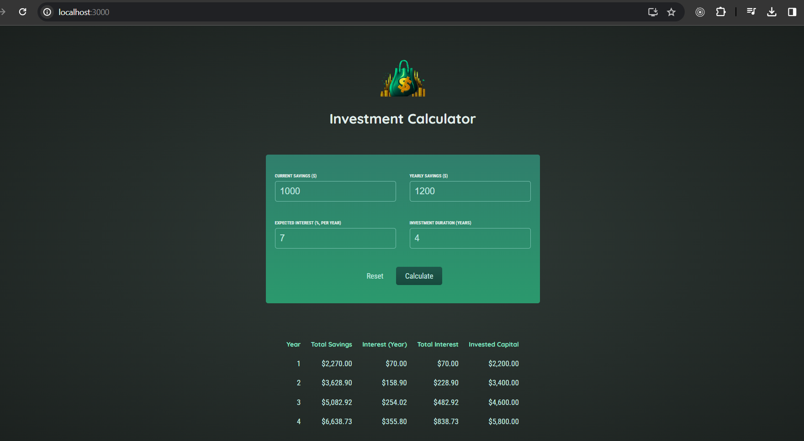

An expense tracking application built with React, providing various functionalities to manage and present expense data. Users can input expenses, filter them by year, and visualize the data through charts.
State Management with useState Hook is used to manage the state of selected filter year. Event Handling, handles user interactions, such as selecting filter options. JavaScript Date Methods is used in components like to format and display dates appropriately.

Domain: https://finance-tool.vercel.app/

